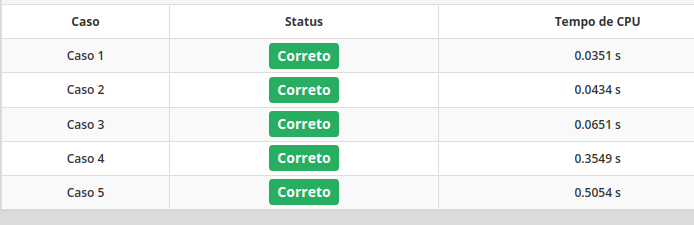
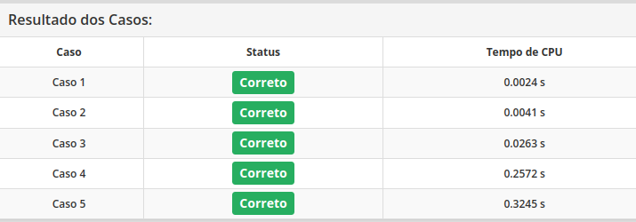

# Arvore Geradora Minima

Trabalho 2 da disciplina CK0111 - Algoritmos em Grafos.

Docente: *Pablo Mayckon*.

---

## Escreva um programa que compute o peso de uma Árvore Geradora Mínima do grafo recebido como entrada

### 1. Formato da Entrada

A entrada, recebida através da entrada padrão, estará no formato UCINET DL, lista de arestas ("edgelist1"), sem rótulos para os vértices mas com pesos para as arestas, conforme o seguinte exemplo:

```bash

dl
format=edgelist1
n=4
data:
2 4 -61.500
1 3 83.750
1 2 -29.500
3 4 78.000
2 3 5.125
```

- Observe que, no formato acima, os vértices são numerados a partir de 1.

---

### 2. Formato da Saída

A saída, fornecida através da saída padrão, tem que estar no formato ilustrado pelo seguinte exemplo, que é a saída esperada para a entrada acima:

```bash
-85.875
```

---

## Sobre o Algoritmo

Em ambos os codigos foi-se utilizado o algoritmo de Kruskal para computar a AGM

> Codigo em Python


Feito em python algoritmo alcançou o tempo aceitavél

> Codigo em C++


Ocorreu em tempo melhor, a "tradução" do código foi feita com auxílio do ChatGPT
